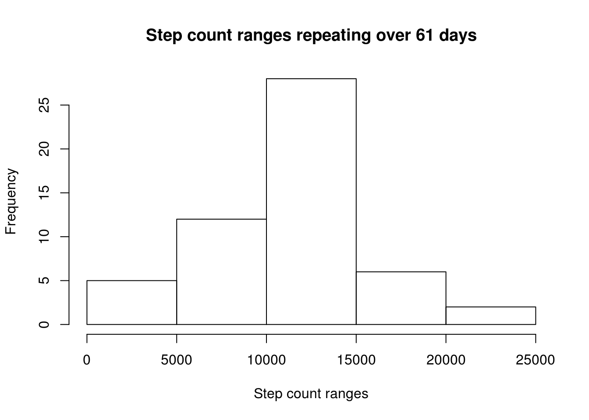
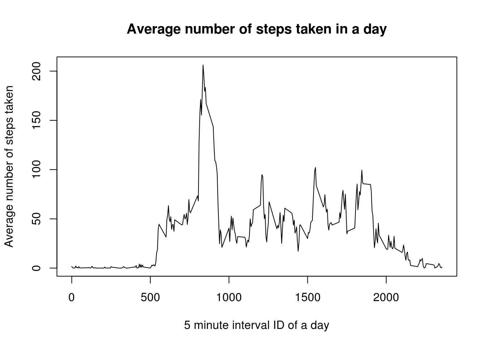
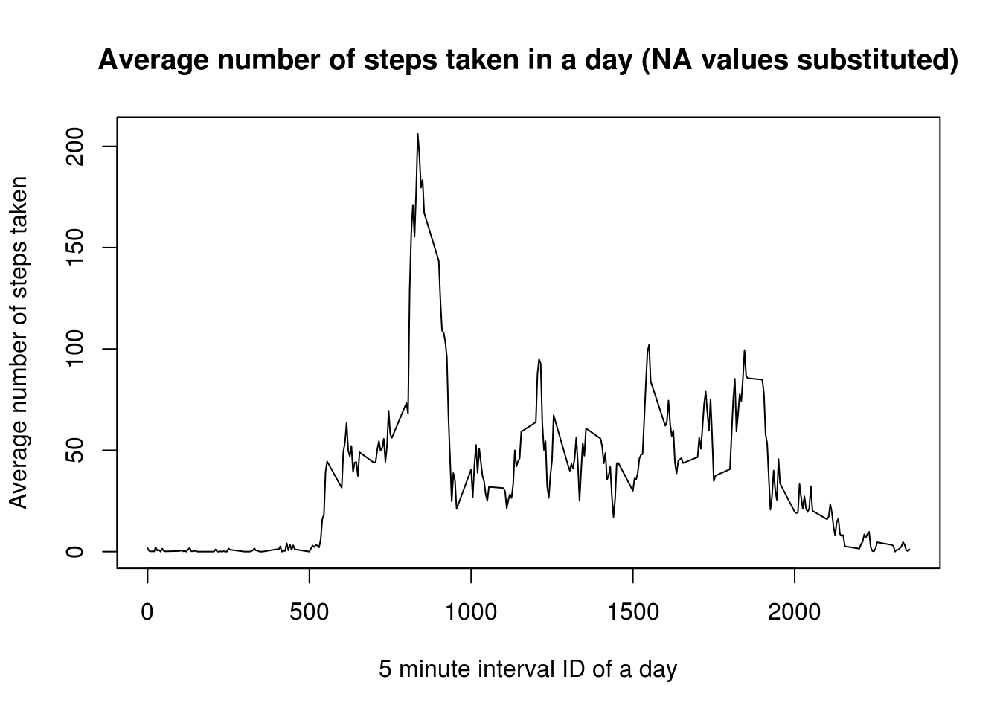
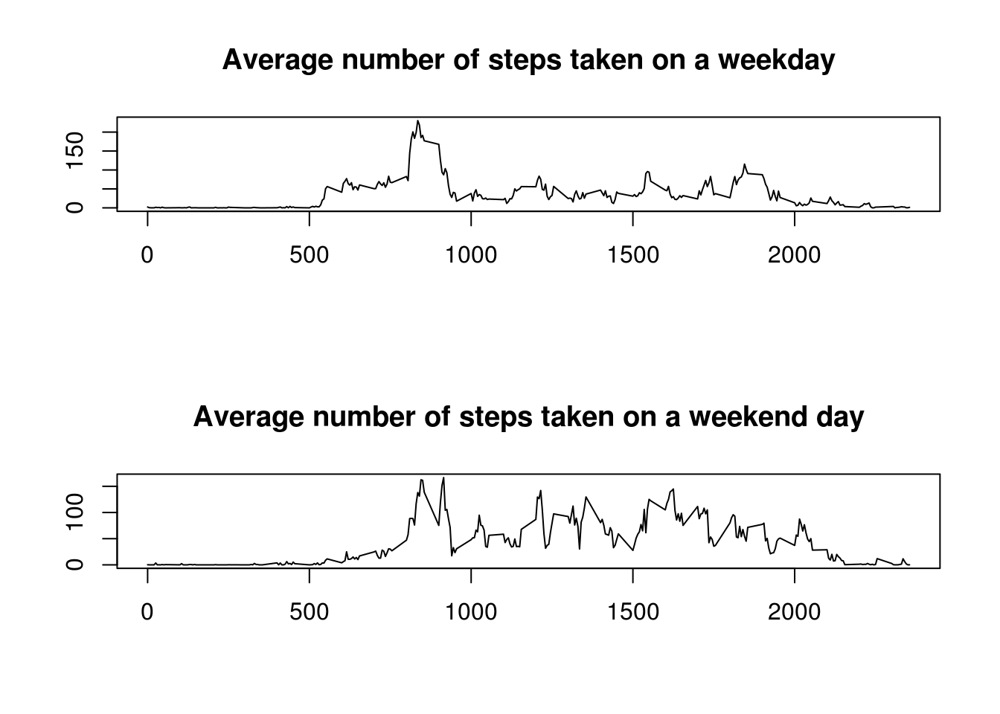

#### R packages required

_reshape2_


## Loading and preprocessing the datset

1. The raw data is downloaded from [this link](https://d396qusza40orc.cloudfront.net/repdata%2Fdata%2Factivity.zip).
2. It is a zip file containing the data in CSV format. It is extracted to the working directory.
4. _read.csv()_ reads the data from file to an object named 'DATA'.

( _I prefer to code defensively_. Thereby, my script checks if the CSV file is present or not, in the directory.)


```r
if(!("repdata%2Fdata%2Factivity.zip" %in% list.files()))
# if the zip file is not present in the working directory by the default name,
{
        download.file("https://d396qusza40orc.cloudfront.net/repdata%2Fdata%2Factivity.zip",
                      destfile = "./FILEZIP.zip",
                      quiet = TRUE)
        ## After downloading the zip file, extract the CSV file.
        unzip("./FILEZIP.zip")
}
# reading the CSV file
DATA<-read.csv("./activity.csv",stringsAsFactors = FALSE)
```

5. _reshape2::melt()_ melts 'DATA' where the ID variable is 'date' and it is measured against 'steps'.NA values for 'steps' were discarded during this step of dataframe reshaping.

6. _reshape2::dcast()_ casts 'MELT_DATA' such that the final data frame displays the total number of steps taken on each day, from 1st October 2012 to 30th November 2012.


```r
MELT_DATA<-melt(DATA,id = "date", measure.vars = "steps", na.rm = TRUE)
CAST_DATA<-dcast(MELT_DATA,date~variable,sum)
```

## Mean total number of steps taken per day

Using the _hist()_ to plot a histogram for number of steps taken for 61 days,


```r
hist(CAST_DATA$steps,
     main = "Step count ranges repeating over 61 days",
     xlab = "Step count ranges",
     ylab = "Frequency")
```

<!-- -->

Calculating the mean and median using _mean()_ and _median()_,


```r
MEAN<-mean(CAST_DATA$steps)
MEDIAN<-median(CAST_DATA$steps)
```

**NOTE: Only 53 days had acounted-for values for 'steps' after discarding NA values**

1. MEAN number of steps taken by the individual for duration of 61 days = 10766.1886792
2. MEDIAN number of steps taken by the individual for duration of 61 days = 10765

## Average daily activity pattern

'DATA' is again melted to form a dataframe where the ID variable is 'interval'. NA values for 'steps' were discarded during this step.


'MELT_DATA' is cast to a new dataframe where 'interval' variable contains the mean number of steps taken in each 5-minute interval ID over the course of 61 days.


```r
MELT_DATA<-melt(DATA,id = "interval", measure.vars = "steps", na.rm = TRUE)
CAST_DATA<-dcast(MELT_DATA,interval~variable,mean)
```


Making a time series plot where

X AXIS = _'5 minute interval ID of a day'_


Y_AXIS = _'Average number of steps taken in this interval over 61 days_

Generating a line plot using _plot()_ using the option _type = "l"_


```r
plot(CAST_DATA$interval,
     CAST_DATA$steps,
     main = "Average number of steps taken in a day",
     xlab = "5 minute interval ID of a day",
     ylab = "Average number of steps taken",
     type = "l")
```

<!-- -->


```r
maxSteps<-max(CAST_DATA$steps)
maxStepID<-CAST_DATA$interval[CAST_DATA$steps==maxSteps]
```

The 5-minute interval ID with the maximum number of steps on an average over the course of 61 days is calculated as 835.

## Imputing missing values


```r
NA_vector<-is.na(DATA$steps)
NACount<-sum(NA_vector)
```

The data frame has 2304 NA values for 'steps' variable.


NA values for 'steps' variable brings about an instrintic bias in the data. I replace the NA values with values of mean number of steps for every 5 minute interval ID. 


```r
values<-sapply(DATA[NA_vector,"interval"],function(x){CAST_DATA[which(CAST_DATA$interval==x),"steps"]})
DATA[NA_vector,"steps"]<-values
```


'DATA' now has no NA values for the 'steps' variable.


```r
MELT_DATA<-melt(DATA,id = "interval", measure.vars = "steps")
CAST_DATA<-dcast(MELT_DATA,interval~variable,mean)
```


Making a second time series plot where

X AXIS = _'5 minute interval ID of a day'_


Y_AXIS = _'Average number of steps taken in this interval over 61 days_


```r
plot(CAST_DATA$interval,
     CAST_DATA$steps,
     main = "Average number of steps taken in a day (NA values substituted)",
     xlab = "5 minute interval ID of a day",
     ylab = "Average number of steps taken",
     type = "l")
```

<!-- -->

After this modification, 


```r
MEAN<-mean(CAST_DATA$steps)
MEDIAN<-median(CAST_DATA$steps)
```

1. MEAN number of steps taken by the individual for duration of 61 days = 37.3825996
2. MEDIAN number of steps taken by the individual for duration of 61 days = 34.1132075

## Are there any differences in activity patterns between weekdays and weekends?

A new factor variable is added to 'DATA' such that along a particular row, if the value in the 
'date' variable refers to a weekend day, as in Saturday and Sunday, then the factor variable
(hereby named 'temp') will contain the label 'WEEKEND'. If not a weekend day, the label will be 'WEEKDAY'.


```r
## first, I need to coerce the 'date' variable values as objects of class 'Date'
DATA$date<-as.Date(DATA$date)
DATA$temp<-factor(weekdays(DATA$date) %in% c("Saturday","Sunday"),
                  levels = c(TRUE,FALSE),
                  labels = c("WEEKEND","WEEKDAY"))
```

To create the two time series plots, averaging the number of steps,one across weekdays and the other across the weekends, I create two seperate data frames using _split()_. Then I use _par()_ to embed the two plots one upon the other.


```r
DATA_SPLIT<-split(DATA,DATA$temp)
```

To generate the correct data for each plot, I use _melt()_ and _dcast()_, just like I did before.

For either plot,

X AXIS = _'5 minute interval ID of that day'_


Y_AXIS = _'Average number of steps taken in this interval'_


```r
par(mfrow=c(2,1))

#plot 01
MELT_DATA<-melt(DATA_SPLIT$WEEKDAY,id = "interval",measure.vars = "steps")
CAST_DATA<-dcast(MELT_DATA,interval~variable,mean)
plot(CAST_DATA$interval,
     CAST_DATA$steps,
     main = "Average number of steps taken on a weekday",
     xlab = "",
     ylab = "",
     type = "l")

#plot02
MELT_DATA<-melt(DATA_SPLIT$WEEKEND,id = "interval",measure.vars = "steps")
CAST_DATA<-dcast(MELT_DATA,interval~variable,mean)
plot(CAST_DATA$interval,
     CAST_DATA$steps,
     main = "Average number of steps taken on a weekend day",
     xlab = "",
     ylab = "",
     type = "l")
```

<!-- -->
